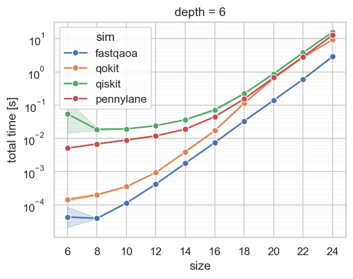

# Fast-QAOA

A fast and lightweight Quantum Approximate Optimization Ansatz simulator with fast
differentiation is written in C.

## Installation

Fast-QAOA depends on roughly nothing, On the Python side, it requires `numpy`, and on the
C side, it requires `liblbfgs`, which is available through most package managers.

```
poetry install
```
should install the dependencies and build the C dependencies. The Makefile should work
on Linux and MacOs (Apple-Silicon) systems. However, manual adjustments might be
necessary in some cases.


## Concept

Fast-QAOA relies on the fact that the optimization problem gets brute forced in each
application of the problem Hamiltonian evolution of QAOA. In deep circuits, as well as,
for parameter optimization, the brute-forced result can be stored and directly applied by
multiplication on the state vector.

Furthermore, the application of the mixer Hamiltonian, commonly an application of
Pauli-X-rotations on all qubits have a similar structure to the Fast-Fourier-Transform.
Only O(N log N) operations are therefore required for one iteration. Likewise to FFT,
the simultaneous application of two gates may save some operations (In FFT these are
called radix-4-butterflies). This implementation prefers two-gate applications over
single-gate ones.

## Workflow

### Diagonalization

As the main part of Fast-QAOA is the stored and diagonalized Hamiltonian, we start by
brute-forcing the optimization problem to hand. In the following, we do that with an
exemplary Max-Cut problem. Max-Cut is not further introduced here, for more
information, see [here](https://en.wikipedia.org/Maximum_cut).

The problem is defined on a graph
```python
import networkx as nx

G = nx.erdos_renyi_graph(6, 0.5, seed=8001)

# build the terms of the hamiltonian
terms = {e: 2. for e in G.edges()}
terms.update({(v,): -float(G.degree(v)) for v in G.nodes()})

# terms = {
#   (0, 4): 2.0, (1, 3): 2.0, (1, 4): 2.0, (1, 5): 2.0, (2, 4): 2.0, (2, 5): 2.0,
#   (3, 5): 2.0, (0,): -1.0, (1,): -3.0, (2,): -2.0, (3,): -2.0, (4,): -3.0, (5,): -1.0
# }
```

The Hamiltonian is the sum of the product of binary variables times bias. The product is
given as tuple keys of a dictionary. Now, utilizing the `Diagonals` object, we can brute
force the problem, as follows

```python
from fastqaoa import Diagonals

dg = Diagonals.brute_force_hamiltonian(6, terms)

# dg.to_numpy() -> [0. -1. -3. ... -3. -1.  0.]
```

### QAOA application

The QAOA circuit is paramterized by `p` betas and gammas paramters, for now hardcoded
as. Yet, `fastqoaa.params` features parameter initialization methods. The full QAOA
circuit can be computed by simply
```python
from fastqaoa import qaoa

betas = [0.9, 0.5, 0.1]
gammas = [0.1, 0.5, 0.9]

sv = qaoa(dg, betas, gammas)
```
where `sv` is a `Statevector` object. We can either compute the expectation value form
it by
```python
print(dg.expec(sv))
# -4.922789608617443
```
or sample form the state vector probabilities, i.e. measuring the prepared state
frequently
```python
samples = sv.sample(100)

# The expectation value can also be computed from the samples
print(dg.expec(samples))
# -4.95
```

### Parameter Optimization

The parameters can be optimized using the cost function from beforehand and
gradient-free optimizers. Alternatively, we can use gradient-based optimizers. In a QC
application, that would require gradient computation through methods like parameter
shift. Nevertheless, in simulation, we can rely on computing the exact gradient
```python
from fastqaoa import grad_qaoa

val, grad_betas, grad_gammas = grad_qaoa(dg, dg, betas, gammas)
# val = -4.922789608617443
# grad_betas = [-0.11524348  1.19118023 -3.51788873]
# grad_gammas = [ 0.75853451 -0.8354133  -0.11325605]
```
The second `dg` in `grad_qaoa` refers to the Hamiltonian, w.r.t. wich the derived
expectation values is calculated. In principle, this one can deviate from the Problem
Hamiltonian.

Fast-QAOA features a built-in parameter optimizer based on L-BFGS. The limited memory
part is not really important, as the number of parameters considered is generally
not the bottleneck. However, `liblbfgs` is an excellent implementation of the BFGS procedure.

To optimize parameters, simply write
```python
from fastqaoa import optimize_qaoa_lbfgs

res = optimize_qaoa_lbfgs(dg, dg, betas, gammas)

# LBFGSResult(status=<LBFGSStatus.Success: 0>, it=29, betas=[1.43203, 0.43962492, 0.2790024],
# gammas=[-0.83682539,  1.5541561 ,  1.02302044], calls=39, log=[-5.27183532, -5.3352494 , ..., -5.60470587])
```

### Evaluate results

Fast-QAOA comes with a metrics tool that automatically computes most of the important
metrics for QAOA results. It is used as shown below

```python
from fastqaoa import Metrics

sv = qaoa(sv, res.betas, res.gammas)

constr = Diagonals.array(np.ones(1 << 6)) # if states are infeasible mark with 0 inestead of 1
metrics = Metrics.compute(sv, dg, constr)

print(metrics.dump())
# {'energy': -5.6047058, 'approx_ratio': 0.9341176, 'p_opt': 0.713482, ...}
```

## Benchmarks

Fast-QAOA is currently only focused on single-core performance (multi-core is yet to come
but no focus). The benchmarks are run against
[QOKit](https://github.com/jpmorganchase/QOKit),
[Qiskit](https://www.ibm.com/quantum/qiskit) (Aer Statevector simulator) and
[Pennylane](https://pennylane.ai/) (Lightning CPU). All simulators are set to use
single-core only. The Benchmarks are run on an Apple M1 Mac, Fast-QAOA and QOKit were
compiled with Apple Clang with optimization level O3.

First, let's compare simulation time (left: including brute forcing, right: without brute
force) at QAOA depth 6:



as apparent Fast-QAOA performs the fastest out of all. However, in pure simulation time, QOKit is on par with Fast-QAOA.
The full circuit simulators are considerably worse in comparison. Let's look at simulation time w.r.t. layer depth at size 24.


## Notes on documentation

The documentation is, unfortunately, so far very tenuous. Any user of the library should
be welcome to contribute to the docs.
